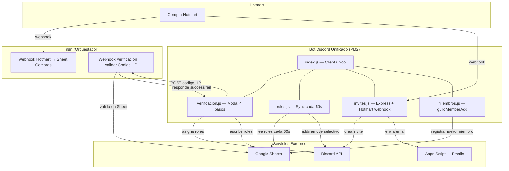

# Nico Barrera Academy — Bot Discord Unificado

Bot de Discord unificado para Nico Barrera Academy. Un solo bot, un solo token, sirviendo 2 programas educativos en 2 servidores Discord diferentes. Gestiona verificacion de compras Hotmart, sincronizacion de roles, generacion de invitaciones y registro de miembros.

| Programa | Servidor Discord | Productos Hotmart |
|----------|-----------------|-------------------|
| Programa A (Proyecto Inversionista Consciente) | Guild A | 2 productos |
| Programa B (Creeser) | Guild B | 2 productos |

## Arquitectura



## Estructura del proyecto

```
app-discord-verificacion-roles/
├── index.js                  # Entry point — crea Client, registra modulos, login
├── config.js                 # Config multi-programa (guildIds, roles, sheets, webhooks, emails)
├── package.json              # Dependencias y script start
├── credentials.json          # Service account de Google (NO commitear en repos publicos)
├── cleanup-duplicates.js     # Script one-off para limpiar filas duplicadas en Sheets
├── CLAUDE.md                 # Guia de arquitectura para Claude Code
├── modules/
│   ├── verificacion.js       # Flujo 4 pasos → Modal codigo Hotmart → n8n → roles → Sheet
│   ├── roles.js              # Sync bidireccional cada 60s, add/remove selectivo
│   ├── invites.js            # Express server: invites, webhooks Hotmart, emails
│   └── miembros.js           # Escucha guildMemberAdd, registra en Sheet
├── utils/
│   ├── sheets.js             # Google Auth + getRows/appendRow/updateRow (RAW)
│   ├── discord.js            # asignarRoles(), enviarBotonVerificacion()
│   └── logger.js             # Pino con pino-pretty
└── .env                      # Variables de entorno (ver .env.example)
```

## Flujos de datos

### 1. Compra Hotmart → Invite → Email

```
Hotmart envia webhook POST → invites.js valida HOTTOK
→ Busca programa por product ID → Crea invite Discord 1 uso (24h)
→ Envia email branded via Apps Script con link de invite
→ Cache anti-duplicados por email::programa (30min TTL)
```

### 2. Verificacion Discord → Roles

```
Usuario hace clic en boton "Verificar Compra"
→ 4 pasos de aceptacion (terminos, privacidad, reglas, disclaimer)
→ Modal: ingresa codigo Hotmart (HP-XXXXXXXX)
→ POST a n8n webhook → n8n valida codigo en Sheet "Compras de Hotmart"
→ Si valido: asigna roles + markVerified(120s) + escribe roles en Sheet
→ Respuesta efimera con roles asignados
```

### 3. Sync de roles (cada 60 segundos)

```
roles.js lee Sheet del programa → Deduplica filas por userId
→ Construye set de roles gestionados (config + Sheet + ciclo anterior)
→ Para cada miembro: compara roles actuales vs Sheet
→ .add() roles faltantes / .remove() roles sobrantes
→ Salta usuarios recien verificados (120s TTL)
→ Nunca toca roles no gestionados (admin, moderador, etc.)
```

### 4. Nuevo miembro se une

```
guildMemberAdd → Detecta programa por guildId
→ Verifica si userId ya existe en Sheet (con fallback de precision)
→ Si es nuevo: appendRow con username, displayName, tag, userId
```

## Variables de entorno

| Variable | Descripcion | Donde obtenerla |
|----------|-------------|-----------------|
| `DISCORD_TOKEN` | Token del bot de Discord | [Discord Developer Portal](https://discord.com/developers/applications) → Bot → Token |
| `GOOGLE_CREDENTIALS_PATH` | Ruta al archivo credentials.json | Google Cloud Console → Service Account → Keys → JSON |
| `HOTTOK` | Token de autenticacion de Hotmart | Hotmart → Configuraciones → Webhooks → HOTTOK |
| `PORT` | Puerto del servidor Express | Libre eleccion (default: 3000) |
| `GUILD_ID_A` | ID del servidor Discord Programa A | Discord → Click derecho en servidor → Copiar ID |
| `INVITE_CHANNEL_ID_A` | ID del canal para generar invites Programa A | Discord → Click derecho en canal → Copiar ID |
| `HOTMART_PRODUCT_A1` | ID del producto 1 de Hotmart Programa A | Hotmart → Productos → ID del producto |
| `HOTMART_PRODUCT_A2` | ID del producto 2 de Hotmart Programa A | Hotmart → Productos → ID del producto |
| `SHEET_ID_A` | ID del Google Sheet Programa A | URL del Sheet: `docs.google.com/spreadsheets/d/{ESTE_ID}/edit` |
| `N8N_WEBHOOK_A` | URL del webhook n8n para verificacion Programa A | n8n → Workflow "Verificar Compras" → Nodo Webhook → URL |
| `APPSCRIPT_URL_A` | URL del Apps Script para emails Programa A | Apps Script → Deploy → URL de implementacion |
| `APPSCRIPT_TOKEN_A` | Token de autenticacion Apps Script Programa A | Definido en el codigo del Apps Script |
| `GUILD_ID_B` | ID del servidor Discord Programa B | Igual que Programa A pero para el otro servidor |
| `INVITE_CHANNEL_ID_B` | ID del canal para invites Programa B | Igual que Programa A |
| `HOTMART_PRODUCT_B1` | ID del producto 1 Programa B | Hotmart → Productos |
| `HOTMART_PRODUCT_B2` | ID del producto 2 Programa B | Hotmart → Productos |
| `SHEET_ID_B` | ID del Google Sheet Programa B | URL del Sheet |
| `N8N_WEBHOOK_B` | URL del webhook n8n Programa B | n8n → Workflow → Webhook URL |
| `APPSCRIPT_URL_B` | URL del Apps Script Programa B | Apps Script → Deploy |
| `APPSCRIPT_TOKEN_B` | Token Apps Script Programa B | Definido en Apps Script |

## Setup local

1. **Clonar el repositorio**
   ```bash
   git clone <url-del-repo>
   cd app-discord-verificacion-roles
   ```

2. **Instalar dependencias**
   ```bash
   npm install
   ```

3. **Configurar variables de entorno**
   ```bash
   cp .env.example .env
   # Editar .env con los valores reales
   ```

4. **Agregar credentials de Google**
   - Crear service account en Google Cloud Console
   - Descargar JSON de credenciales
   - Guardar como `credentials.json` en la raiz del proyecto
   - Compartir los Google Sheets con el email del service account

5. **Iniciar el bot**
   ```bash
   npm start
   # o directamente:
   node index.js
   ```

6. **Verificar**
   - El bot aparece online en ambos servidores Discord
   - Los logs muestran conexion exitosa
   - El servidor Express responde en `http://localhost:{PORT}/health`

## Deploy con PM2

```bash
# Instalar PM2 globalmente
npm install -g pm2

# Iniciar el bot
pm2 start index.js --name "nico-bot"

# Ver logs en tiempo real
pm2 logs nico-bot

# Reiniciar
pm2 restart nico-bot

# Detener
pm2 stop nico-bot

# Auto-arranque al reiniciar el servidor
pm2 startup
pm2 save
```

**Importante**: Verificar que no haya procesos Node zombie antes de iniciar:
```bash
# Linux/Mac
ps aux | grep "node index.js"

# Windows
tasklist | findstr node
```

## Agregar un tercer programa

Solo requiere cambios en configuracion, sin tocar codigo de modulos:

1. **Agregar variables al `.env`**:
   ```
   GUILD_ID_C=...
   INVITE_CHANNEL_ID_C=...
   HOTMART_PRODUCT_C1=...
   HOTMART_PRODUCT_C2=...
   SHEET_ID_C=...
   N8N_WEBHOOK_C=...
   APPSCRIPT_URL_C=...
   APPSCRIPT_TOKEN_C=...
   ```

2. **Agregar entrada en `config.js`** dentro de `PROGRAMS`:
   ```javascript
   programaC: {
     name: 'Nombre del Programa',
     guildId: process.env.GUILD_ID_C,
     inviteChannelId: process.env.INVITE_CHANNEL_ID_C,
     products: [process.env.HOTMART_PRODUCT_C1, process.env.HOTMART_PRODUCT_C2],
     roles: ['Activo'],  // roles a asignar en verificacion
     roleColumns: [{ index: 4, letter: 'E' }],  // columnas del Sheet
     sheetId: process.env.SHEET_ID_C,
     sheetRange: 'miembros_discord!A2:E',
     webhookN8n: process.env.N8N_WEBHOOK_C,
     // ... appscript, email config
   }
   ```

3. **Crear Google Sheet** con la estructura de columnas correspondiente

4. **Crear workflow n8n** de verificacion para el programa (o reutilizar existente con logica de ruteo por product ID)

5. **Reiniciar el bot** — los modulos lo detectan automaticamente via `getProgramByGuildId` y `getProgramByProductId`

## Google Sheets — Estructura de columnas

### Programa A (miembros_discord — columnas A-G)

| Columna | Campo | Descripcion |
|---------|-------|-------------|
| A | username | Nombre de usuario Discord |
| B | displayName | Nombre visible en el servidor |
| C | tag | Tag completo (usuario#0000) |
| D | userId | ID numerico de Discord (18-19 digitos) |
| E | Estado | Rol: "Activo" |
| F | Generacion | Rol: "2026-1.2" (o la generacion actual) |
| G | Nivel | Rol: "Iniciador de Mercados" (o el nivel actual) |

### Programa B (miembros_discord — columnas A-E)

| Columna | Campo | Descripcion |
|---------|-------|-------------|
| A | username | Nombre de usuario Discord |
| B | displayName | Nombre visible |
| C | tag | Tag completo |
| D | userId | ID numerico de Discord |
| E | Estado | Rol: "Activo" |

## Constraints criticos

Estas reglas existen por bugs que ocurrieron en produccion. Violarlas causa perdida de datos o comportamiento erratico.

### 1. Nunca usar `member.roles.set()`
Usar solo `.add()` y `.remove()` sobre roles gestionados. El bug original: multiples bots usando `.set()` se sobreescribian roles entre si.

### 2. Llamar `markVerified()` inmediatamente despues de asignar roles
Esto crea una ventana de 120 segundos donde el sync de roles no toca al usuario. Sin esto, un ciclo de sync que leyo el Sheet antes de la escritura borraria los roles recien asignados.

### 3. Siempre escribir roles al Sheet despues de asignarlos
Para que el siguiente ciclo de sync (despues de los 120s) encuentre los roles correctos en el Sheet.

### 4. Usar `valueInputOption: 'RAW'` en Google Sheets
Los userIds de Discord son numeros de 18-19 digitos. Con `USER_ENTERED`, Google Sheets los interpreta como numeros y pierde los ultimos digitos (ej: `1234567890123456789` → `1234567890123456780`).

### 5. Deduplicar filas por userId
Si hay filas duplicadas para un mismo usuario, solo se procesa la que tiene mas roles. Esto previene que duplicados vacios sobreescriban asignaciones validas.

### 6. Cache de invites por `email::programName`
No solo por email. Una persona puede comprar ambos programas y cada uno necesita invite a un servidor diferente.

### 7. Solo UN proceso del bot a la vez
Procesos zombie de Node mantienen la conexion a Discord Gateway y reciben eventos duplicados, causando escrituras dobles en Sheets.

## Troubleshooting

### El bot no aparece online
- Verificar que `DISCORD_TOKEN` es correcto
- Verificar que no hay otro proceso del bot corriendo (`pm2 list` o `tasklist`)
- Revisar logs: `pm2 logs nico-bot`

### Los roles no se sincronizan
- Verificar que el Sheet tiene datos en las columnas de roles (E, F, G para Programa A; E para Programa B)
- Si las columnas estan vacias, el sync no hace nada (comportamiento seguro)
- Verificar que el bot tiene permisos de "Manage Roles" en Discord
- El rol del bot debe estar ARRIBA de los roles que intenta asignar en la jerarquia de Discord

### Los userIds aparecen con digitos erroneos en el Sheet
- Verificar que `sheets.js` usa `valueInputOption: 'RAW'`
- Los datos legacy con precision perdida se manejan con fallback `startsWith(id.slice(0, 15))`
- Para limpiar: ejecutar `node cleanup-duplicates.js`

### El webhook de Hotmart no funciona
- Verificar que `HOTTOK` coincide con el configurado en Hotmart
- Verificar que el puerto del Express esta accesible desde internet
- El endpoint es `POST /api/hotmart/webhook`
- Revisar logs del bot para ver si el request llega

### La verificacion falla (codigo HP invalido)
- Verificar que el workflow de n8n "Verificar Compras" esta activo
- Verificar que la URL del webhook en `N8N_WEBHOOK_*` es correcta
- Verificar que el codigo existe en el Sheet "Compras de Hotmart" con Estado "Pendiente"

### Roles se quitan al verificar
- Esto era el race condition historico. Verificar que `markVerified()` se llama inmediatamente despues de `asignarRoles()` en `verificacion.js`
- Verificar que `roles.js` chequea `isRecentlyVerified()` antes de modificar roles

## Scripts utiles

```bash
# Limpiar filas duplicadas en Sheets (por userId, conserva la fila con mas roles)
node cleanup-duplicates.js

# Ver estado de PM2
pm2 status

# Monitorear uso de recursos
pm2 monit
```

## Stack tecnico

| Tecnologia | Version | Uso |
|------------|---------|-----|
| Node.js | 18+ | Runtime |
| discord.js | ^14.20 | Bot de Discord |
| Express | ^5.1 | Servidor HTTP para webhooks |
| googleapis | ^105 | Google Sheets API |
| Pino | ^9.12 | Logging |
| Bottleneck | ^2.19 | Rate limiting |
| undici | ^7.16 | HTTP fetch |
| PM2 | - | Process manager (produccion) |

## Dependencias externas

- **Google Sheets**: Base de datos de miembros y compras
- **n8n**: Orquestador de webhooks y validacion de codigos Hotmart
- **Apps Script**: Envio de emails branded con link de invite
- **Hotmart**: Plataforma de compras (envia webhooks)
